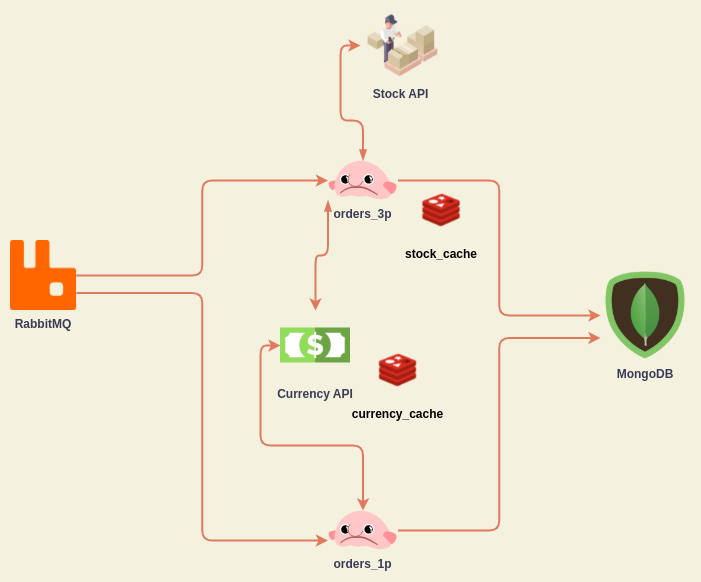

# Benthos Cross-Checkout

## About

This project aims to exemplify the use of Benthos to create ETLs.

The scenario created here is for two different types of consumers for order processing. One for 1p products, and the other for 3p. 
Both need to convert currency values to BRL, and persist on mongo. But only `orders_3p` needs to check items stock on `Stock API`.




## Tests

To run the tests first you must install Benthos locally

```sh
curl -Lsf https://sh.benthos.dev | bash
```

Then:

```sh
cd etl/
benthos test ./...
``` 


## How to run?

Install APIs dependencies
```sh
cd mocks/api/currency-api/ && npm i && cd ../stock-api && npm i
```

```sh
docker-compose up -d
``` 


## Dependencies

- Benthos
- MongoDB
- RabbitMQ
- Redis
- APIs (located in mocks/api)
    - Stock-API
    - Currency-API


## RabbitMQ

### Queues

The queues are automatically declared by its consumers. They are:

- `benthos_orders_1p`
- `benthos_orders_3p`

### Messages

The input message are the same for both queues, like the example:

```json
{
    "user_id": "116a03b6-756e-4058-bad1-f3bbb6d819ef",
    "items": [
        {
            "id": "a45c14df-a4d9-4185-8198-0dab34bd9420",
            "quantity": 2,
            "cost": {
                "value": 3.00,
                "currency": "USD"
            }
        },
        {
            "id": "b5a7ac02-bb6a-4cbd-bda0-334df0c7979e",
            "quantity": 1,
            "cost": {
                "value": 12.00,
                "currency": "BRL"
            }
        }
    ]
}
```
## MongoDB

The database is also created automatically when the first messages is processed by the ETL. The database name will be `cross_checkout`, with colelction `orders`


### Results

The ETL will produce items like these:


For `orders_1p`:

```json
{
	"_id" : "61afe9ca9b64be8123798ca9",
	"total" : 30.27,
	"user_id" : "116a03b6-756e-4058-bad1-f3bbb6d819ef",
	"items" : [
		{
			"cost" : {
				"currency" : "USD",
				"value" : 3
			},
			"total_brl" : 18.27,
			"id" : "b2bdbc85-0fff-4618-8abc-7db80fce3258",
			"quantity" : 2
		},
		{
			"cost" : {
				"value" : 12,
				"currency" : "BRL"
			},
			"total_brl" : 12,
			"id" : "8cbd6851-5ad0-4b2b-bb85-176f8469e20e",
			"quantity" : 1
		}
	]
}
```

For `orders_3p`:

```json
{
	"_id" : "61afe9ca9b64be8123798ca9",
	"total" : 30.27,
	"user_id" : "116a03b6-756e-4058-bad1-f3bbb6d819ef",
	"items" : [
		{
			"availability" : {
				"status" : "instock"
			},
			"cost" : {
				"currency" : "USD",
				"value" : 3
			},
			"total_brl" : 18.27,
			"id" : "b2bdbc85-0fff-4618-8abc-7db80fce3258",
			"quantity" : 2
		},
		{
			"availability" : {
				"status" : "instock"
			},
			"cost" : {
				"value" : 12,
				"currency" : "BRL"
			},
			"total_brl" : 12,
			"id" : "8cbd6851-5ad0-4b2b-bb85-176f8469e20e",
			"quantity" : 1
		}
	]
}
```

## Redis

Redis is being used as a cache to avoid too many requests to our APIs. So the keys will be created as: 

- `currencies`

```json
{
  "BRL": 1,
  "EUR": 6.33,
  "USD": 5.61
}
```

- `stock_{ITEM_ID}`
```json
{
  "status": "instock"
}
```

## APIs

(located in `/mocks/api`)

The APIs were built in Node.JS with a single entrypoint file (`index.js`) to serve the needed routes for this PoC. 
### currency-api

`GET - /currencies/from/brl`

The values for `EUR` and `USD` are random between `5 and 7`, this logic can be replaced on its `index.js` file.

- Example response:
```json
{
  "BRL": 1,
  "EUR": 6.33,
  "USD": 5.61
}
``` 


### stock-api

`GET - /products/:product_id`

The products definitions about stock are initially declared by a static array of strings. So the only availables products on mock are:

```javascript
[
    '234d617f-9d77-4931-aea1-0e5c62ff4801',
    '3ab1d7fb-0780-4702-a01e-13b7014c4d57',
    'f9bf06c2-8407-4284-88ed-7f2dd2d84371',
    '7949afc1-96d2-475b-a9b4-2eaca71f3d1f',
    '8cbd6851-5ad0-4b2b-bb85-176f8469e20e',
    'b2bdbc85-0fff-4618-8abc-7db80fce3258'
]
```

- Example response:
```json
{
  "status": "instock"
}
``` 
